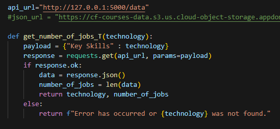
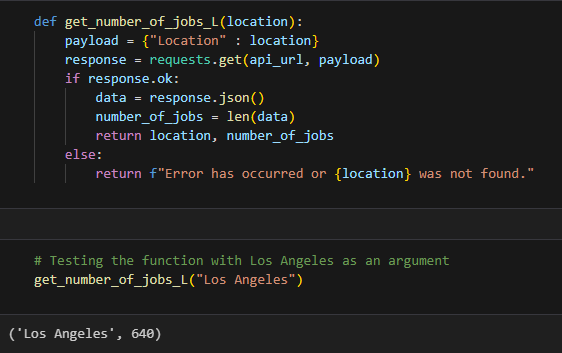
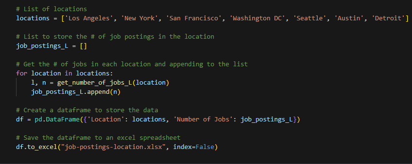
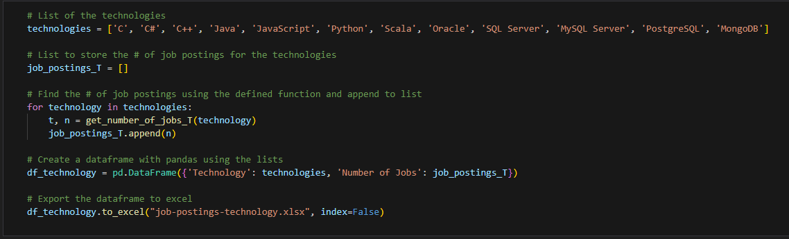

<h1>Data Collection - Jobs API</h1>

This is part of the <a href = 'https://github.com/FaiLuReH3Ro/IBM-DataAnalyst-Capstone'>IBM Data Analyst Capstone - Python</a> project and part of the <a href = 'https://github.com/FaiLuReH3Ro/IBM-DA-Capstone-Py?tab=readme-ov-file#data-collection'>Data Collection</a> section.

<h2>Dataset Used</h2>

Dataset Source: https://www.kaggle.com/promptcloud/jobs-on-naukricom

> Note: The dataset in this notebook is modified. The original dataset is a CSV and is converted to JSON here.

<h2>Using the Jobs API</h2>

The API was provided by IBM

<ol>
    <li>Download the Jobs_API.ipynb file</li>
    <li>Place the file in the same folder as this file</li>
    <li>Run all the cells in the Jobs API notebook</li>
</ol>

Original Source: [Jobs_API](https://cf-courses-data.s3.us.cloud-object-storage.appdomain.cloud/IBM-DA0321EN-SkillsNetwork/labs/module%201/Accessing%20Data%20Using%20APIs/Jobs_API.ipynb) (Downloads a Jupyter notebook)

<h2>Objectives</h2>

<ul>
    <li>Determine the number of jobs open for various technologies</li>
    <li>Determine the number of jobs open for various locations</li>
    <li>Export the data to an Excel spreadsheet</li>
</ul>

<h2>Tools Used</h2>

* Jupyter notebook
* Python
* Pandas
* Requests

